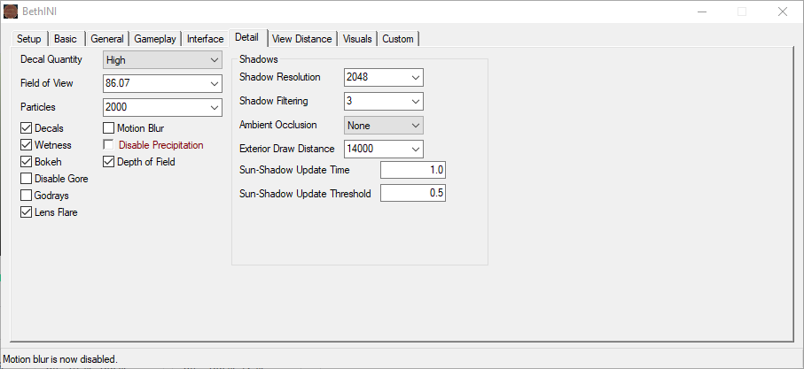

**TABLE OF CONTENTS**
- [INI Files](#ini-files)
  - [Installing BethINI](#installing-bethini)
  - [BethINI - Setup](#bethini---setup)
  - [BethINI - Basic](#bethini---basic)
  - [BethINI - Interface](#bethini---interface)
  - [BethINI - Detail](#bethini---detail)
  - [Save Changes](#save-changes)
- [ENBSeries](#enbseries)

# INI Files

## Installing BethINI

Created by DoubleYou, a staff member on the STEP team, BethINI provides a clean interface for tweaking and customising INI files for Bethesda games. Redundant or potentially dangerous lines are removed by default, and the vanilla presets were greatly improved.

- Navigate to Your Modding Folder and create two new folders inside:
  - `Fallout 4 Modding\Tools\BethINI`
- Download the latest version of [BethINI](https://www.nexusmods.com/fallout4/mods/67?tab=files) from the Nexus.
- Open the download archive and double-click the **BethINI Standalone** folder inside.
- Extract everything into your new **BethINI** folder.
- Make sure Mod Organizer 2 is closed, then double-click **BethINI.exe**.

## BethINI - Setup

- Upon launching BethINI, you will be asked to choose a game. Select **Fallout 4** from the drop-down list.
- If BethINI cannot find Fallout 4 automatically, click **OK** and navigate to:
  - `steamapps\common\Fallout4`
- Double-click **Fallout4.exe**.
- When asked about custom INIs, click **No**.
- In the **Setup** tab, make sure that **Mod Organizer** points at the correct folder.
- Set the **INI Path** to **ModOrganizer > Phoenix Fallout**. BethINI will restart.

## BethINI - Basic

- Set **Resolution** to your monitor's current resolution. Remember that you will lose frames when going from 1080p to 1440p.
- Check **Recommended Tweaks** and select the **High** preset.
- Uncheck **VSYNC**.

## BethINI - Interface

All instructions below are optional.

- You can toggle Subtitles (Dialogue, General) here or ingame.
- Change the interface colours to your liking. These are my personal tweaks:
  - **Subtitles:** *unchanged*
  - **HUD:** 255, 255, 255
  - **Damage HUD:** *unchanged*
  - **Pipboy:** 255, 255, 255
  - **Power Armor Pipboy:** 192, 255, 110
  - **Item Highlight:** 192, 255, 110
  - **Power Armor Item Highlight:** 192, 255, 110
  - **VATS Target Light:** *unchanged*
  - **Wire Connection Highlight:** 192, 255, 110

## BethINI - Detail

- You can tweak the **Field of View** if the default of 70 is too wide or too narrow for your taste.
- Uncheck **Motion Blur** to get rid of the blur effect.
- Uncheck **Godrays**, they eat frames for breakfast.
- If you are going to use an ENBSeries preset with AO, set **Ambient Occlusion** to **None**.

## Save Changes

- Return to the second tab, **Basic**, and click **Save and Exit**.

# ENBSeries