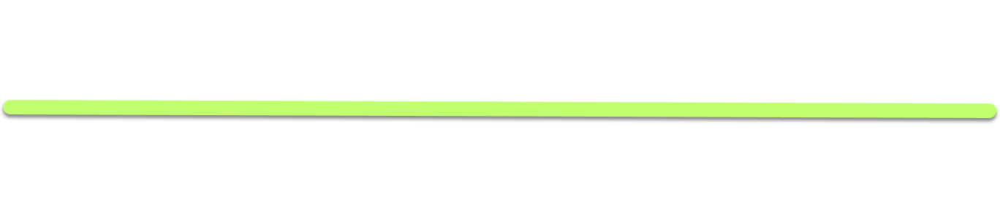

# Valdacil's Item Sorting

### Why VIS

While [Valdacil's Item Sorting](https://www.nexusmods.com/fallout4/mods/3877) has technically been superceeded by [VIS-G Item Sorting](https://www.nexusmods.com/fallout4/mods/33383), I am a stubborn person, and much prefer VIS' more simplistic sorting and icons over VIS-G.

I am using all VIS modules with the exception of the Armor, Weapon, and Cosmetics ones which I replaced with sorting systems of my own. All other modules are installed as usual through the VIS FOMOD and were tweaked afterwards.

### Modules

All plugins were edited in some way. I added DLC support and forwarded UFO4P edits where necessary.

- **ValdacilsItemSorting-AidReducedWeight.esp**
- **ValdacilsItemSorting-Misc.esp**
- **ValdacilsItemSorting-Junk+DEF_INV.esp**
- **ValdacilsItemSorting-Mods.esp**
- **ValdacilsItemSorting-Ammo.esp**
- **ValdacilsItemSorting-Perks.esp**

### VIS Explosives

- Sort to bottom version.
- Added new tag {Trap} for the Far Harbor traps (which are classified as explosives).

### VIS Aid

- Reduced weight version.
- Chems and Syringer Ammo have weight again, but quest items remain weightless.
- Set weight for gourds and melons to 0.5 because they were way too light.

### VIS Junk

- Vanilla weight version with DEF_UI support.
- Forwarded UFO4P edits.
- Includes Not Junk changes, however the following items were turned into scrap again:
  - Cigar
  - Cigarette
  - Lit Cigar
  - Lit Cigarette
  - Lit Stogie
  - Stogie
- Added DEF_UI tags for the DLC scrap items.
- Some non-quest items with zero weight now have 0.1 weight (i.e. pens).
- Empty bottles are now prefixed: `Empty [Type] Bottle{{{Scrap}}}`.
- Shem Drowne's skull is now unique and unscrappable.

### VIS Mods

- Vanilla weight version.

### VIS Ammo

- Vanilla weight version.
- Mini Nukes now have a unique icon.

# Phoenix - Weapon Sorting

### General Changes

- The new ICONLIBS2 contains many additional icons for unique or rare weapons which were never used by VIS. I added more custom tags to utilise many of those icons.
- The Deliverer was removed from the dn_CommonWeapon INNR so that it doesn't get its name changed when you upgrade it. The weapon is unique anyway.
- Edited the names applied to unique leveled items so that they are consistent with my new tags.

### Naming - dn_CommonGun

`(Pipe Rifle) Pipe Sniper Rifle of the Exterminator {Scoped}`

*I genuinely lack the brain cells to understand rulesets 4-6. I'll figure them out eventually.*

- Ruleset #0: The sorting tag.
- Ruleset #1: Prefix applied where appropriate (Operators, Experimental MIRV, etc).
- Ruleset #2: The weapon type (Rifle, Sniper Rifle, Pistol, etc).
- Ruleset #3: The legendary effect if the item is legendary.
- Ruleset #4: Mods.
- Ruleset #5: Mods.
- Ruleset #6: Mods.
- Ruleset #7: Mods for flare gun / mortars / paintball guns.

VIS rules. Redid Ruleset #0 for my new Ranged weapon tags.

### Naming - dn_CommonMelee

`|Bat| Swatter of Ghoul Slaying (Barbed)`

- Ruleset #0: The sorting tag.
- Ruleset #1: Special name if appropriate (Disciples Knife, Swatter, Rocket Bat, etc).
- Ruleset #2: The legendary effect if the item is legendary.
- Ruleset #3: The applied mod if there is one.

VIS rules. I redid Ruleset #0 for my new Melee weapon tags and removed Ruleset #4 for material / color.

### Sorting

- (Generic)
- [Heavy]
- {Special}
- |Melee|

# Phoenix - Cosmetics Sorting

### General Changes

- Since assigning tags through the dn_Clothes INNR is unfortunately extremely unreliable, I added the tags manually to each piece of clothing / apparel. I am using similar categories as VIS. The tags are listed below.
- Edited the names applied to unique leveled items so that they are consistent with my new tags.
- Edited the dn_VaultSuit INNR to move the lining to the end of the item name and into brackets without breaking the Creation Club support.
- Edited the new UFO4P_MiningHelmet INNR so that the helmets are named in consistence with all other items.

### Tags

| Acessories  | Outfits     | Factions       |
| ----------- | ----------- | -------------- |
| (Hat)       | [Casual]    | [Military]     |
| (Eyewear)   | [Dapper]    | [Raider]       |
| (Mask)      | [Dress]     | [Vault Tec]    |
| (Ring)      | [Rugged]    | [BOS]          |
| (Bandolier) | [Skimpy]    | [Railroad]     |
| (Dog)       | [Biosuit]   | [Minutemen]    |
|             |             | [Institute]    |
|             |             | [Atom]         |
|             |             | [Super Mutant] |

### Naming - dn_CommonClothes

`[Dapper] Dirty Blue Suit (Armored)`

- Ruleset #0: Left empty (with an asterisk) so that the pre-tagged default names are used.
- Ruleset #1: The mod (only two available, Institute Killing and Ballistic Weave).

### Naming - DN_VaultSuit

`[Vault Tec] Vault 111 Jumpsuit [Protective]`

- Ruleset #0: The sorting tag (Vault Tec).
- Ruleset #1: Creation Club condition.
- Ruleset #2: Creation Club vault number.
- Ruleset #3: Creation Club color.
- Ruleset #4: The lining.

### Naming - UFO4P_MiningHelmet

`(Helmet) Mining Helmet (Black)`

- Ruleset #0: The sorting tag (Helmet).
- Ruleset #1: The colour (Grey, Green, etc).

Edited for proper tags and consistency.

### Sorting

- (Cosmetics)
- [Outfits]
- {Armor}
- |Power Armor|

# Phoenix - Armor Sorting

### General Changes

- The plugin covers all helmets. Those that cannot be modded were tagged manually.
- DC Guard armor is not moddable and was tagged manually.
- Added Ruleset #4 to the INNR so that the resulting names have the armor slot in them, eg "{LegL} Operators Heavy Left Leg" instead of "{LegL} Operators Heavy Armor" (the tags are hidden).
- Edited the names applied to unique leveled items so that they are consistent with my new tags.
- Edited Ruleset #6 to always use ().
- Edited Ruleset #7 to always use [].

### Naming - dh_CommonArmor

`{LegL} Leather Sturdy Left Leg of Bolstering (Treated) [Cushioned]`

- Ruleset #0: The sorting tag (armor slot).
- Ruleset #1: The base material type or faction (Leather, Robot, Disciple, etc).
- Ruleset #2: The weight / size (Light, Sturdy, Tough).
- Ruleset #3: The second type for some armors (mostly for Nuka World raider armors).
- Ruleset #4: The slot occupied by the armor piece (Helmet, Right Arm, etc).
- Ruleset #5: The legendary effect if the item is legendary.
- Ruleset #6: The material / rank.
- Ruleset #7: The lining.

### Sorting

- (Cosmetics)
- [Outfits]
- {Armor}
- |Power Armor|

# Phoenix - Power Armor Sorting

### General Changes

- In the ArmorBySlot override, I discovered that while there are several INNR lists for power armor, they are identical. I pointed all power armor sets to the primary **dn_PowerArmor** list and disregarded the other ones.
- I changed some names: "Raider Power" > "Raider" and "Overboss Power" > "Overboss".
- Added the piece to the name, eg: "X-01 Mk. 1" > "X-01 Left Arm Mk. 1".
- Edited the names applied to unique leveled items so that they are consistent with my new tags.
- Removed the space (Mk.1 > Mk. 1) in Ruleset #3.

### Naming - dn_PowerArmor

`|PA ArmL| T-51 Left Arm Mk. 3 of the Hunter (Assembled)`

- Ruleset #0: The sorting tag (power armor piece, sort by slot).
- Ruleset #1: The type of power armor (T-60, X-01, etc).
- Ruleset #2: The armor piece in question (torso, helmet, etc).
- Ruleset #3: The upgrade level (used to be different for all PAs).
- Ruleset #4: The legendary effect if the item is legendary.
- Ruleset #5: The additional enhancement (like Bracers or Databased).

VIS rules. I tweaked #0 and #3, and added #2.

Materials and Paint Jobs (which are split by PAMAP and my custom PA Paint Job tweaks) will not immediately show up in the name. You can see them upon inspecting the piece.

### Sorting

- (Cosmetics)
- [Outfits]
- {Armor}
- |Power Armor|

# Sorting Files

- The **Valdacil's Item Sorting - Config Files** mod folder contains the default VIS lyrConf.xml and DEF_INV_TABS.xml files which define the Pipboy inventory tabs and which items are sorted into them.
- The **Updated ICONLIBS2 for DEF_UI** mod folder contains an updated iconlibs2.swf with new and fixed icons. They can all be viewed in the included PDF document which is what I used as reference.
- The **Custom DEF_INV_TAGS xml** is my sorting config file which includes all the customised tags and icons for my sorting overhaul. Tags for all objects were set to hidden so that only the icons will appear.